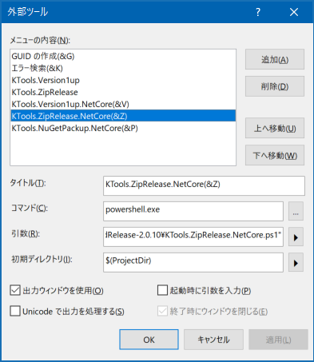

# Build Release
A set of tools to build a .NET project.

The following tools are contained:
- [**Version 1up**](#version-1up)
- [**Zip Release**](#zip-release)
- [**NuGet Packup**](#nuget-packup)

There are options to use the tools:
- Download [the PowerShell script files](https://github.com/sakapon/Build-Release/tree/master/Downloads) and extract them to any folder
- Add the PowerShell scripts above to `External Tools` in Visual Studio (**recommended**)
- Install the PowerShell script files to a .NET project by NuGet

See [Usage](#usage) for details.

## Version 1up
The PowerShell script to increment the assembly version.
- For the .NET Framework project format
- For the .NET Core project format

  
[NuGet Gallery | KTools.Version1up](https://www.nuget.org/packages/KTools.Version1up/) (for the .NET Framework project format)

### Specification
- Increment the build number of the assembly version (`z` of `x.y.z`)
  - AssemblyInfo.cs for .NET Framework
  - Project files for .NET Core

## Zip Release
The PowerShell script to build the project and create a ZIP file.
- For the .NET Framework project format
- For the .NET Core project format

  
[NuGet Gallery | KTools.ZipRelease](https://www.nuget.org/packages/KTools.ZipRelease/) (for the .NET Framework project format)

### Specification
- Increment the assembly version (call the [**Version 1up**](#version-1up))
- Build a release by the MSBuild
- Create a ZIP file from the build result

## NuGet Packup
The PowerShell script to build the project and create a NuGet package.
- For the .NET Core project format

### Specification
- Increment the assembly version (call the [**Version 1up**](#version-1up))
- Build a release by the MSBuild
- Create a NuGet package from the build result

## Usage
There are options to use the tools:
- Download the latest version of [the PowerShell script files](https://github.com/sakapon/Build-Release/tree/master/Downloads) and extract them to any folder
  - Execute the scripts on the project folder
- Add the PowerShell scripts above to `External Tools` in Visual Studio (**recommended**)
  - Execute the menu on the project
- Install the PowerShell script files to a .NET project by NuGet
  - Execute the scripts on the project folder

You can customize the PowerShell script to meet your needs.

### How to Add the Scripts to External Tools in Visual Studio
Choose the menu `Tools > External Tools`, and add a new content with the following information:
- Title: any
- Command: `powershell.exe`
- Arguments: `-ExecutionPolicy Unrestricted "C:\scripts_folder\KTools.xxx.ps1"`
- Initial directory: `$(ProjectDir)`
- Use Output window: `On`

## Release Notes
- **v2.1.14**
  - Add [**Initial Set**](#initial-set).
  - Update paths to MSBuild.exe for Visual Studio 2019.
- **v2.0.10** For .NET Core.
- **v1.2.6** Find the path to .ps1 files, regardless of the current directory.
- **v1.2.5** Find the path to MSBuild.exe.
- **v1.2.4** Rename .ps1 files.
- **v1.1.3** The first release.

## References
- [.NET Regular Expressions](https://msdn.microsoft.com/library/hs600312.aspx)
- [.nuspec File Reference for NuGet](https://docs.microsoft.com/en-us/nuget/schema/nuspec)
- [NuGet Package Version Reference](https://docs.microsoft.com/en-us/nuget/reference/package-versioning)
- [Manage external tools](https://docs.microsoft.com/en-us/visualstudio/ide/managing-external-tools)

### My Blog
- [.NET ビルド小技集 (4)](https://sakapon.wordpress.com/2015/10/23/dotnet-build-4/)
- [ビルドして ZIP にする PowerShell スクリプト](https://sakapon.wordpress.com/2018/02/06/zip-release/)
- [ビルド用のスクリプトを Visual Studio の外部ツールに登録する](https://sakapon.wordpress.com/2018/08/20/external-tools-build/)
- [.NET Core 向けビルド スクリプト](https://sakapon.wordpress.com/2018/09/01/build-release-netcore/)
