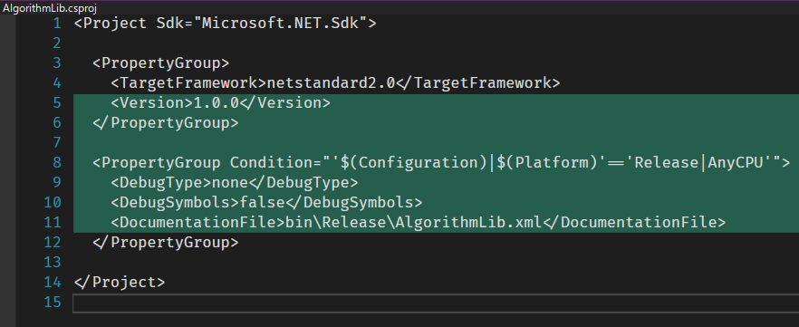
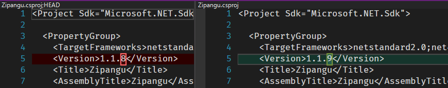
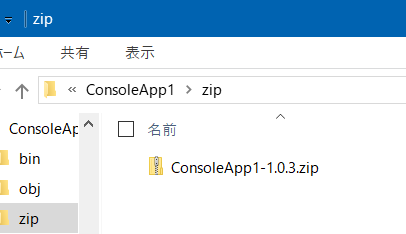
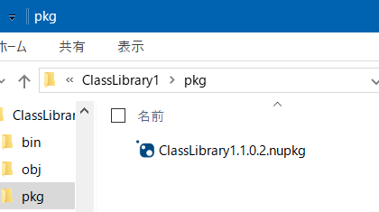

# Specification
The following tools are contained:
- [**Initial Set**](#initial-set)
  - For the .NET Framework project format
  - For the .NET Core project format
- [**Version 1up**](#version-1up)
  - For the .NET Framework project format
  - For the .NET Core project format
- [**Zip Release**](#zip-release)
  - For the .NET Framework project format
  - For the .NET Core project format
- [**NuGet Packup**](#nuget-packup)
  - For the .NET Core project format

## Initial Set
The PowerShell script to add initial settings to the project that will be released.
- Add the setting for the assembly version
  - AssemblyInfo.cs for .NET Framework
  - Project files for .NET Core
- Set `Debug Information` (`DebugType`) to none
- Add the setting for the XML Documentation file in case of DLL
  - .NET Core only

## Version 1up
The PowerShell script to increment the assembly version.
- Increment the build number of the assembly version (`z` of `x.y.z`)
  - AssemblyInfo.cs for .NET Framework
  - Project files for .NET Core

## Zip Release
The PowerShell script to build the project and create a ZIP file.
- Increment the assembly version (call the [**Version 1up**](#version-1up))
- Build a release by the MSBuild
- Create a ZIP file from the build result

## NuGet Packup
The PowerShell script to build the project and create a NuGet package.
- Increment the assembly version (call the [**Version 1up**](#version-1up))
- Build a release by the MSBuild
- Create a NuGet package from the build result

